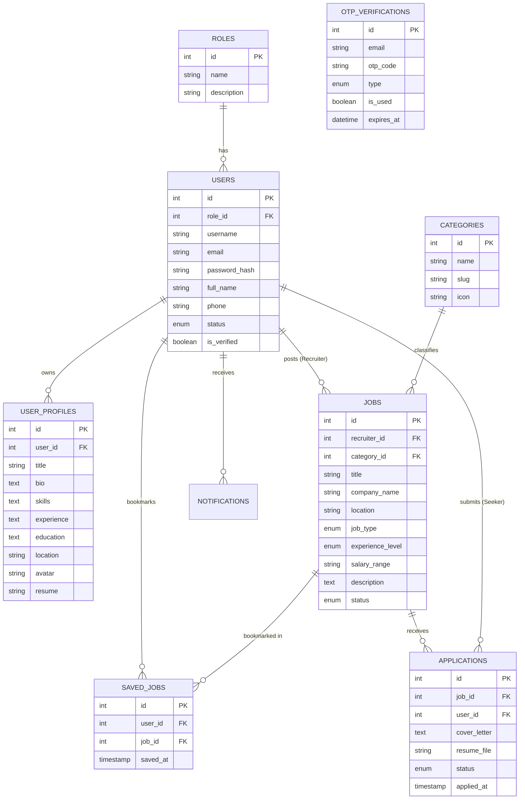

# CareerConnect - Database ER Diagram & Data Architecture

## 1. Entity Relationship Diagram (Mermaid)

---

## 2. Table Normalization Analysis (3NF)

1. **First Normal Form (1NF)**: All attributes contain atomic values. Repeated structures (such as role strings or category metadata) have been removed.
2. **Second Normal Form (2NF)**: All non-key attributes are fully functionally dependent on primary keys. Composite keys in junction tables (`applications`, `saved_jobs`) are enforced with `UNIQUE` constraints.
3. **Third Normal Form (3NF)**: Transitive dependencies are eliminated. Role titles and descriptions reside exclusively in `roles`, preventing data anomaly redundancies.
